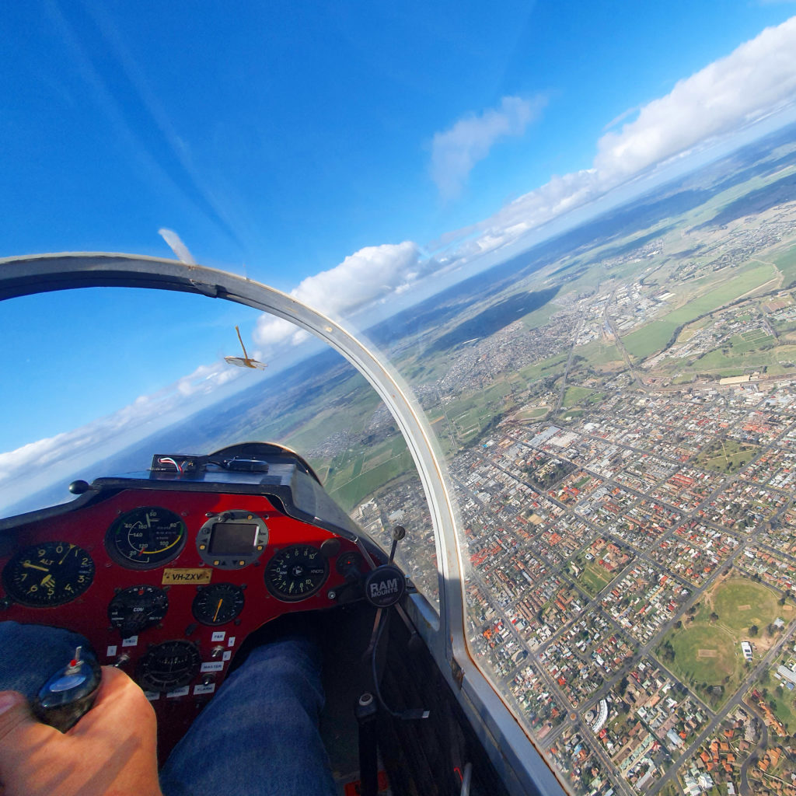
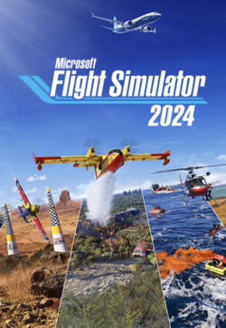

As 2025 comes to an end, I've been thinking about my own journey to gaining my commercial pilot licence and multi-engine instrument rating. With all my (in)experience of 300 hours total time flying aeroplanes, **below are my thoughts and tips for getting your commercial pilot licence**. Your mileage may vary.

But first (and I will come back to this point throughout), if your goal is to fly aeroplanes and potentially earn money flying aeroplanes, then **you have a long-term goal that will require a significant short-to-medium-term investment** in terms of both time and money. This time and financial investment **has to be sustainable** - not just for you, but potentially for your support network as well.

<!--more-->

## Tip 1: Join a Gliding Club

First, join a gliding club! The gliding community is full of **people who are just as excited as you about flying** (or even more so!) and people who have a **wealth of experience flying all different types of aircraft**, which you generally won't at this point! I honestly think there's no better way to start *and continue* your piloting journey than being part of a gliding community.

Early in my own journey, I joined the [Bathurst Soaring Club](https://www.bathurstsoaringclub.com.au/) and together with the excellent volunteer (!) instructors, I learned to fly the club gliders, learned the basics of soaring in thermals and importantly, learned how to land a plane without an engine - which is very relevant for any single-engine aeroplane.

But gliding clubs are communities of volunteers - don't view your club as a stepping-stone to bigger things but rather, a home-base where **you can pay it forward as you gain more experience**, staying on to continue towards instructing others, aircraft maintenance, or flying a tug - there are plenty of ways to be able to help the would-be pilots who come after you to take their first flights in a glider.

On top of all those benefits, flight time in a sailplane can count towards your total flight time for your pilot logbook, under certain circumstances.

Note: I'm also a member of [Bathurst Aero Club](https://www.bathurstaeroclub.com.au/) - another great place to rent a C172 and meet people!

## Tip 2: Find a school that you trust

You will be investing a lot of time and money into a pilot school so it is absolutely worthwhile **investing some initial time in choosing a school that not only suits your personal needs, but that you can *trust***.

Personally, I needed a school which allowed me to progress at my own pace (since I work another job 3 days a week) and wasn't too far from home. I ended up doing my commercial licence and my multi-engine IFR with [PanAir Flight Training](https://www.panairflighttraining.com/) in Bathurst who have a transparent per-hour cost on their website and a great team to work with. The Head of Operations, Tammy Camileri, has a lot of experience flying for the [PanAir charter company](https://www.panair.com.au/) together with her partner, Charlie (and they also [race jets on the side](https://www.flylikeagirl.com.au/)).

But there are many schools out there, some excellent, and some not so great, so it's worth your initial time investment to choose well. For what it's worth, I've also had an excellent experience with Luke Patterson, formerly of WardAir at Bathurst, with whom I did my initial PPL training, as well as with the much larger [FlyOz](https://flyoz.com.au/) school at Cowra, through whom I've done various flight examinations.

## Tip 3: Set Up a Decent Simulator

Flight simulation technology has come a long way in the past years. A home simulator not only allows you to practise procedures at your local airport, it will even **allow you to fly with human air traffic control to practise your radio work**, if you want to!

But there is **so much to learn in the world of simulation that it can be overwhelming too**. I'd suggest seeing your simulator use as a long-term project as well, that will help sustain your piloting, and just enjoy it through each stage while learning new things when it makes sense for your pilot progression. For example:

- Initially, **just enjoy the simulator** and explore the world and your local airports while learning how to use the sim and practising basic pilot skills.
- Once you're feeling more familiar, you may want to begin **using the sim to practise flights and procedures related to your training**. Emergency procedures are excellent to practise on the simulator, as are start-up procedures and trips out to your local training area for stalls or steep turns, or cross-country flights that you are planning.
- After six months or so, when you're comfortable with the simulator, you may want to consider joining the Virtual Air Traffic Simulation Network - [VATSIM](https://vatsim.net/), then joining your local community and doing some VFR flights with real radio work. It's a great way to practise your radio work while flying (and mic-fright is a real thing here too, so it can help you get over that too) and is a gentler introduction than jumping straight in to IFR flights on VATSIM.

I spent around $5,000 on a computer with a decent graphics card, a Honeywell yoke and throttle quadrant, pedals and a second-hand VR headset set up with Microsoft Flight Simulator 2024 and have gotten so much value out of it throughout my pilot training over the past few years. 

There's **so much more that's possible and beneficial to practise on a simulator**, but it should also be noted that **some instructors (who have more experience than me) may warn against a home simulator** where you can develop bad habits that are hard to change once established. This is based on well-established **Law of Primacy** - that what you learn first often sticks with you. I'm not convinced that this means home sims should be avoided, but your instructor may have some good tips about what to practise and what to avoid when using your sim at home during your flight training.

## Tip 4: Enjoy Learning and Stay Ahead of the Theory

When I started my initial training towards my private pilot licence, I knew that it would take me around a year to do the required flight training next to my job, if there were no life emergencies thrown in the mix. My instructor at the time, Luke Patterson, let me know that to satisfy the PPL theory, **you can *either* do a single PPL exam covering all seven topics, or alternately you can sit the seven separate commercial pilot exams**, which go into a little more detail but can be completed over a period of up to two years. Since I had already decided to do the non-integrated pathway, this seemed like a no-brainer at the time.

In retrospect, this was one of the best tips I received, since I could **enjoy learning for each subject in my own time**, one at a time, rather than cramming for one big exam. On top of that, when I completed my PPL flight training, I'd already completed my CPL exams, so **I could just focus on my CPL flight training**. This will differ on individual goals and time-frames of course, but for me it was an excellent tip.

Lastly, there is a huge amount of content to consume and learn throughout pilot training. The last thing you want to do is cram to pass tests and then let your theory decay over time. I use the excellent [Anki flashcards](https://apps.ankiweb.net/) spaced repetition system, which

> helps you spend more time on challenging material, and less on what you already know.

This approach helps to keep important concepts fresh in your memory throughout your training and beyond your exams.

## Tip 5: Make your training sustainable

I know I've already said this throughout the above, but it is important enough to have its own tip: a pilot licence is a **huge investment** that will affect not just you but also your network of support. **It is a long-term investment which needs to be sustainable to be successful**, not just financially, but also in terms of the **time required by you and the cost that has on your relationships**. Clearly it's much better to work out a way to achieve your goals in a way that is sustainable longer-term and allows you to support others achieving their own goals too (rather than costing you your relationships).

Unless you are lucky enough to have someone paying your way for you, you will likely **need to work beside your training as well as during breaks from your training to build up funds to continue**. There are multiple strategies that could be worthwhile here:
- a higher-paying job will make it easier in the long-term even if it requires more initial investment. **It may be worth following through on that apprenticeship or TAFE course or uni degree**, not only to be able to fund your pilot training more easily, but also for those times when the pilot industry slumps (who knows where automation will take aviation)
- **break up your pilot training into useful chunks** such as: RPL, PPL, CPL, MEIR, etc., where you can pause and re-evaluate your path after each achievement, enjoying the new privileges of the licence while working some more in that other job to save up.

## Summary

If you're planning on starting out on this journey, I hope these thoughts from a fresh and inexperienced pilot who's just been through the same might be of some value:

1. Join a gliding Club;
2. Take the time to find a school that you can trust;
3. Set up a decent simulator;
4. Enjoy learning and stay ahead of the theory; and
5. Make your training sustainable

Have a safe and successful pilot journey!
